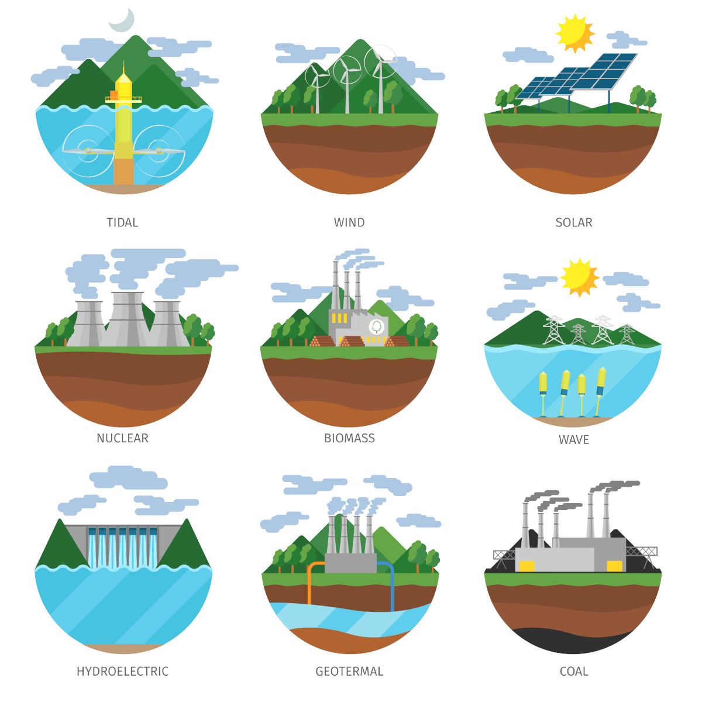
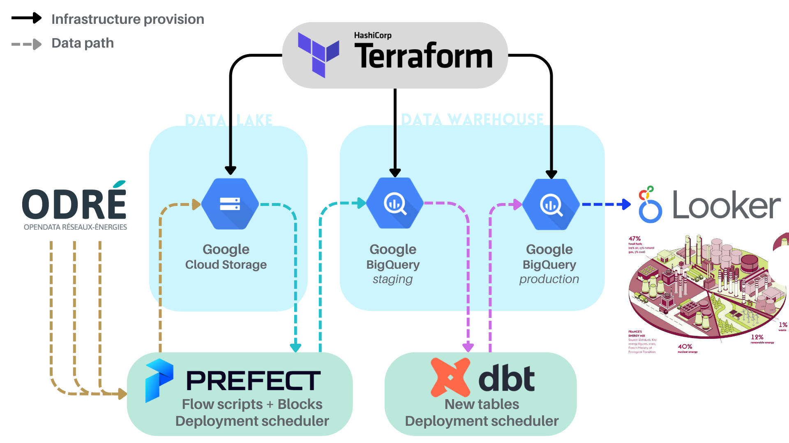

# Distribution of energy sources & temperatures over time in France.

 
<a href="https://www.freepik.com/free-vector/generation-energy-types-power-plant-icons-vector-set-renewable-alternative-solar-tidal-wind-geotermal-biomass-wave-illustration_10601053.htm#track=ais">Image by macrovector</a> on Freepik

---
### Table of contents
- [Objective](#objective)
- [Data sources](#data-sources)
- [Tools](#tools)
- [Reproducing this project](#reproducing-this-project)

---
## Objective

This data engineering project aims to deploy and regularly update a data pipeline from end to end. To do so, this project will use the following steps:

1. Copy data **from the data-sources to the data-lake** *(Google Cloud Storage in this case)*
2. Copy data **from the data-lake to the data-warehouse** *(BigQuery in this case)*
3. Transform and **produce interesting data from the staging-data**, and store them in developpement/production-data *(using DBT)*
4. Create a **custom dashboard to display some of the information** stored in the poduction-data.



--- 
## Data sources

In order to fullfil this project, I selected **3 datasets from the ODRÉ** (Open Data Réseaux Energies) website.

Their dataset are particularly interesting to me, because they provide **live data** that comes diretly **from energy carriers and their partners**, and also because the dataset are **refreshed at various frequencies** ( every 1 hour / 1 day / 1 month).

Furthermore, I think we can use those datasets to answers **interesting questions** such as:
1. What is the repartition of energy sources for a given day or a given period?
2. Is the gas stock correlated in any way with the temperature?
3. Are the energy sources influenced by the temperature?
4. Are the energy sources influenced by the current gas stock?
5. Does the energy sources repartition change with seasons?
6. Are there more commercial exchanges related to energy when the gas stock is full at the borders?
7. ... 


### Dataset 01: `eco2mix-national-tr`

> https://odre.opendatasoft.com/explore/dataset/eco2mix-national-tr

This dataset, refreshed once an hour, presents "real time" data from the éCO2mix application. They come from the telemetry of the infrastructures and are completed with estimations.

It contains:
- The actual consumption.
- The consumption forecasts established the day before (D-1) and those updated the same day (D).
- The production according to the different sectors of the energy mix.
- The consumption of pumps in Pumped Storage Facilities (PST).
- Physical exchanges at the borders.
- An estimate of the carbon emissions generated by electricity production in France.
- The breakdown of the production mix into sectors and technologies.
- The commercial exchanges at the borders.

### Dataset 02: `stock-quotidien-stockages-gaz`

> https://odre.opendatasoft.com/explore/dataset/stock-quotidien-stockages-gaz

This dataset presents the gas stock present in the Teréga and Storengy gas storage facilities, at the end of each day and by PITS since November 1, 2010 (GWh PCS 0°C).

### Dataset 03: `temperature-quotidienne-regionale`

> https://odre.opendatasoft.com/explore/dataset/temperature-quotidienne-regionale

This dataset presents the daily minimum, maximum and average temperatures (in degrees Celsius), by French administrative region, from January 1, 2016 to today. It is based on the official measurements of the French weather station network. The update of this dataset is monthly.

---
## Tools

- **Terraform**: to easily provision the required infrastructures.
- **Prefect**: to execute python scripts that transfer the datasets.
- **dbt**: to transform the data and create new tables from the original datasets.
- **Google Cloud Storage**: for the Data-lake.
- **Google BigQuery**: for the Data-warehouse.
- **Google Looker Studio**: for the Data-visualization.

- **Python**: to write the various *Prefect* scripts.
- **SQL**: to write the various *dbt* models

---
## Reproducing this project

### 1. Setup 

Install PREFECT and other libs

```bash
>>> python -m venv venvProject
>>> source venvProject/bin/activate
>>> pip install -r requirements.txt
>>> prefect version
```


---
---
---

TODO


Run local PREFECT Orion

```bash
>>> prefect orion start
```
open http://127.0.0.1:4200/

Run local PREFECT Agent
```bash
>>> prefect orion start
```


## --------------------------------------------------------------
## Setup Prefect to do ETL and then send the resulting file to Google Cloud Storage (gcs)

see scripts:
- flows/etl_web_to_gcs.py

### Let's create a bucket to store the project files

- Go to GCP-UI // "Cloud Storage" / "Buckets" / "Create"

name --> de_project_gcp_bucket
data location type --> europe-west1(Belgium)
data storage class --> standard (Best for short-term storage and frequently accessed data)

- Click on "CREATE"

### We can see the bucket content

- Go to GCP-UI // "Cloud Storage" / "Buckets" / "de_project_gcp_bucket"

### Let's create an account with the appropriate rights 

- Go to GCD-UI // "IAM & Admin" / "Service Account" / "Create service account"

-->1/ service account-name: PROJECT-NAME-user-bucket (de_project_user_bucket)
-->2/ role: "BigQuery Admin" & "Cloud Storage / Storage Admin"
--> Save
-->3/ .
--> Done

### Let's create a remote key for the account

- Go to GCD-UI // "IAM & Admin" / "Service Account"
- Click '...' and "Manage keys" on the appropriate service account (de_project_user_bucket)
- Go to "Add Key" / "Create new key" / "JSON" --> A json file is saved to the computer

### Let's add the PREFECT GCP Block

Register blocks types within a module or file.
                                                                                                                                                                                   
#### Make sure the targeted blocks is available for configuration via the UI. (If a block type has already been registered, its registration will be updated to match the block's current definition)

>>> prefect block register -m prefect_gcp 

#### Configue the block

- Go to PREFECT-GUI / "Blocks" / "Add Block" / "GCS Bucket"

name --> de-project-user-bucket
bucket-name --> de_project_gcp_bucket

#### Click "ADD" on GCP-Credentials

name --> de-project-gcs-creds
service account info --> copy the content of the JSON file associated with the bucket account (we downloaded it earlier)

--> Done
--> Select the newly created  GCP credential in the select box
--> Create


#### Edit script
==> Add GcsBucket (as explained on the PREFECT-GUI GcSBucket block page)

## --------------------------------------------------------------
## Move the GCS files to BigQuery Data Warehouse

see scripts:
- flows/etl_gcs_to_bq.py

### Let's configure a BigQuery database with the tables schemas

- Go to GCP-UI / "Big Query" / "Add data" / "Google Cloud Storage"

--> Browse to "de-project-user-bucket/data/daily_ecomix.parquet"
--> Project : lexical-passkey-375922
--> Dataset : create a new one with "deproject_dataset" and select it
--> Table : daily_ecomix
--> Click CREATE TABLE

--> Browse to "de-project-user-bucket/data/daily_gaz_supply.parquet"
--> Project : lexical-passkey-375922
--> Dataset : select "deproject_dataset"
--> Table : daily_gaz_supply
--> Click CREATE TABLE

--> Browse to "de-project-user-bucket/data/daily_temperatures.parquet"
--> Project : lexical-passkey-375922
--> Dataset : select "deproject_dataset"
--> Table : daily_temperatures
--> Click CREATE TABLE

Once created, the database will know the 3 tables schemas, and the scripts will be able to push data from GCS to BQ

### Edit script
==> Add df.to_gbd (google big query) call
==> Use the GcpCredentials defined earlier (go to GcpCredentials block on Orion and copy code there)
