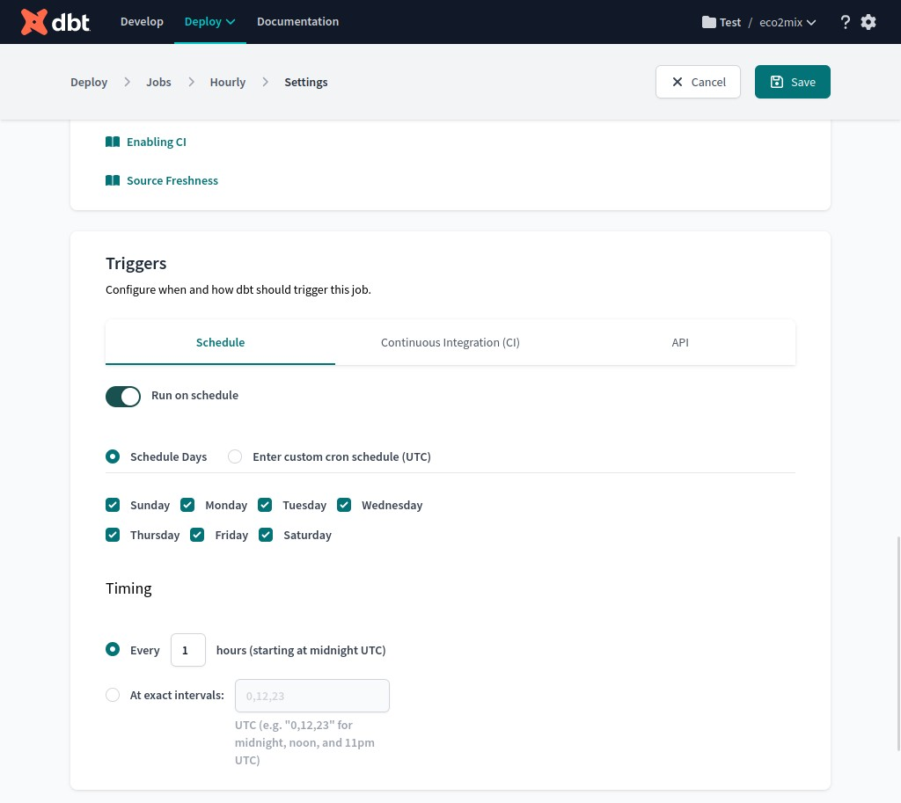

# Distribution of energy sources & temperatures over time in France.

 
<a href="https://www.freepik.com/free-vector/generation-energy-types-power-plant-icons-vector-set-renewable-alternative-solar-tidal-wind-geotermal-biomass-wave-illustration_10601053.htm#track=ais">Image by macrovector</a> on Freepik

---
---
### Table of contents
- [Objective](#objective)
- [Data sources](#data-sources)
- [Tools](#tools)
- [Reproducing this project](#reproducing-this-project)
    1. [Setup GCP](#1-setup-gcp)
    2. [Setup local environment](#2-setup-local-environment)
    3. [Initialize infrastructures with Terraform](#3-initialize-infrastructures-with-terraform)
    4. [Initialize Prefect Orion in Cloud or Locally](#4-initialize-prefect-orion-in-cloud-or-locally)
    5. [Initialize Prefect blocks & deployment](#5-initialize-prefect-blocks--deployment)
    6. [Start Prefect Agent](#6-start-prefect-agent)
    7. [Setup DBT](#7-setup-dbt)
    8. [Setup Looker](#8-setup-looker)
    9. [Clean up](#9-clean-up)

*(This table is accessible at all time from the top left menu accordion, next to README.md)*

---
## Objective

This data engineering project aims to deploy and regularly update a data pipeline from end to end. To do so, this project will use the following steps:

1. Copy data **from the data-sources to the data-lake** *(Google Cloud Storage in this case)*
2. Copy data **from the data-lake to the data-warehouse** *(BigQuery in this case)*
3. Transform and **produce interesting data from the staging-data**, and store them in development/production-data *(using DBT)*
4. Create a **custom dashboard to display some of the information** stored in the production-data.<br>
   (My own version is avaible here: https://lookerstudio.google.com/reporting/a0869f4e-7f24-4b50-8dd0-750aac025e3b)


--- 
## Data sources

In order to fulfil this project, I selected **3 datasets from the ODRÉ** (Open Data Réseaux Energies) website.

Their datasets are particularly interesting to me because they provide **live data** that comes directly **from energy carriers and their partners**, and also because the datasets are **refreshed at various frequencies** ( every 1 hour / 1 day / 1 month).

Furthermore, I think we can use those datasets to answer **interesting questions** such as:
1. What is the repartition of energy sources for a given day or a given period?
2. Is the gas stock correlated in any way with the temperature?
3. Are the energy sources influenced by the temperature?
4. Are the energy sources influenced by the current gas stock?
5. Does the energy sources' repartition change with the seasons?
6. Are there more commercial exchanges related to energy when the gas stock is full at the borders?
7. ... 


### Dataset 01: `eco2mix-national-tr`

> https://odre.opendatasoft.com/explore/dataset/eco2mix-national-tr

This dataset, refreshed once an hour, presents "real-time" data from the éCO2mix application. They come from the telemetry of the infrastructures and are completed with estimations.

It contains:
- The actual consumption.
- The consumption forecasts established the day before (D-1) and those updated the same day (D).
- The production according to the different sectors of the energy mix.
- The consumption of pumps in Pumped Storage Facilities (PST).
- Physical exchanges at the borders.
- An estimate of the carbon emissions generated by electricity production in France.
- The breakdown of the production mix into sectors and technologies.
- The commercial exchanges at the borders.

### Dataset 02: `stock-quotidien-stockages-gaz`

> https://odre.opendatasoft.com/explore/dataset/stock-quotidien-stockages-gaz

This dataset presents the gas stock present in the Teréga and Storengy gas storage facilities, at the end of each day and by PITS since November 1, 2010 (GWh PCS 0°C).

### Dataset 03: `temperature-quotidienne-regionale`

> https://odre.opendatasoft.com/explore/dataset/temperature-quotidienne-regionale

This dataset presents the daily minimum, maximum and average temperatures (in degrees Celsius), by French administrative region, from January 1, 2016 to today. It is based on the official measurements of the French weather station network. The update of this dataset is monthly.

---
## Tools

- **Terraform**: to easily provision the required infrastructures.
- **Prefect**: to execute python scripts that transfer the datasets.
- **dbt**: to transform the data and create new tables from the original datasets.
- **Google Cloud Storage**: for the Data-lake.
- **Google BigQuery**: for the Data-warehouse.
- **Google Looker Studio**: for the Data-visualization.

- **Python**: to write the various *Prefect* scripts.
- **SQL**: to write the various *dbt* models.
- **Makefile**: to simplify the deployment process.

---
## Reproducing this project

> Steps 2, 3, 4, 5, 6 can be used on a **virtual machine** (e.g. GCP VM) if the project needs to fully run remotly.

### 1. Setup GCP

As we will deploy using the Google Cloud Plateform infrastructures, we need to setup a service access to allow the various access for Terraform, Prefect and DBT.

<details>
  <summary>1. To configure the GCP service account, click here</summary>
    
  > 1. Create a GCP **New Project**
  > 
  >
  > 2. **Switch** to the project
  > 3. Go to *IAM & Admin / Service Account /* **Create service account**
  > 4. *Service account details* ---> set *Service account name* to whatever you want
  >
  > 
  >
  > 5. In *Grant this service account access to project* ---> add the following roles:
  >    - Add **Basic / Viewer** *(optional)*
  >    - Add **Cloud Storage / Storage Admin**
  >    - Add **Cloud Storage / Storage Object Admin**
  >    - Add **BigQuery Admin**
  >
  > 
  >
  > 6. Click "DONE"

</details>

<details>
  <summary>2. To get the GCP credential JSON file, click here</summary>
    
  > 1. Go to your **service account page** --> click on **Actions / ... / Manage keys**
  > 
  >
  > 2. Click *Add key / Create new key* then select **JSON** and download the file.
  > 
  >
  > 3. Put it in the **creds** folder in the project *(or wherever you want)*.

</details>

<br>Once we have the GCP credential JSON file for a properly configured service account, we can go ahead.

### 2. Setup local environment

Let's **duplicate the project** github repository

```bash
>>> git clone https://github.com/Valkea/DE_bootcamp_project.git
>>> cd DE_bootcamp_project
```

Then, let's **install PREFECT and other libs** (starting at the root folder of the project)

```bash
>>> python -m venv venv
>>> source venv/bin/activate
(venv) >>> pip install -r requirements.txt
(venv) >>> prefect version # (just to check that prefect is installed)
```

Finally, let's [install Terraform](https://developer.hashicorp.com/terraform/downloads?product_intent=terraform) and [the Google Cloud CLI](https://cloud.google.com/sdk/docs/install)

### 3. Initialize infrastructures with Terraform

```bash
(venv) >>> terraform -chdir=terraform init
(venv) >>> terraform -chdir=terraform plan # (optional) 
(venv) >>> terraform -chdir=terraform apply # (answer 'yes')
```

> At this point you should see:
> - a new empty **eco2mix-de-project-bucket** in your GCP bucket list.
> - three new empty tables in your BigQuery database:
>     - **de_project_staging** (the source tables for DBT)
>     - **de_project_development** (the DBT tests exports)
>     - **de_project_production** (the DBT final exports)
>
> 

### 4. Initialize Prefect Orion in Cloud or Locally


<details>
  <summary>(option 1): to use Prefect Orion in the Cloud (recommended), click here</summary>
  
  > 1. Create a [PREFECT cloud account](http://prefect.io/)
  > 2. Login from the local terminal 
  > ```bash
  > (venv) >>> prefect cloud login
  > ```
  >
  > 
  >
  > 3. (optional) Changing the workspace
  > ```bash
  > (venv) >>> prefect cloud workspace set --workspace "my_workspace_sname"
  > ```

</details>

<details>
  <summary>(option 2): to use Prefect Orion locally, click here</summary>
  
  > The make file executes the following lines
  > ```bash
  > (venv) >>> prefect orion start
  > ```
  >
  > 
  >
  > open http://127.0.0.1:4200/
</details>


### 5. Initialize Prefect blocks & deployment

**Edit the MakeFile** with your *project_id* and the *path to your GCP credential json file*, and initialize using the folloing command

```bash
(venv) >>> make setup
```

<details>
  <summary>If you can't use *make* for any reason click here</summary>
  
  > The make file executes the following lines
  > ```bash
  > (venv) >>> python setup_prefect.py {CREDS_PATH} {PROJECT_ID}
  > (venv) >>> prefect deployment build flows/etl_main.py:etl_main_flow --name etl_eco2mix --cron "0 * * * *" -a
  > ```
</details>


> At this point the Prefect Orion UI *(either in the Cloud or Locally)* should deplay:
> - one deployement **etl-main-flow/etl_eco2mix**
>
> 
> - three blocks
>     - GCP Credentials / **eco2mix-de-project-creds**
>     - GCS Bucket / **eco2mix-de-project-bucket**
>     - JSON / **eco2mix-de-project-variables**
>
> 

### 6. Start Prefect Agent

Whether we use Prefect Orion in the Cloud or Locally, we need to initialize a *Prefect agent* to execute the selected queue

```bash
(venv) >>> prefect deployment run etl-main-flow/etl_eco2mix # (to avoid waiting for the cronjob time)
(venv) >>> prefect agent start --work-queue "default"
```

> 


### 7. Setup DBT

The only solution I found to easily set up the DBT project, is to use the Prefect DBT connector, which relies on the DBT API.
Unfortunately, the DBT API is not available on the free account, so we will need to make it manually (it's not too long).

<details>
  <summary> 1. To configure the DBT Cloud, click here</summary>
    
  <br>In order to reproduce this step-by-step configuration, you will need to clone this repository on your own GitHub account, because at some point the DBT configuration process will ask you to grant access to the repository.
  
  > 1. Create a new account
  > 2. *Choose your connection* ---> select **BigQuery**
  > 
  >
  > 3. *Configure your environment* ---> upload the **GCP JSON file** and it will fill all the required fields
  > 
  >
  > 4. *Development Credentials* ---> set **de_project_development** as database name
  > 
  >
  > 5. *Setup a Repository* ---> use **Git Clone** along with the Git URL of YOUR repository
  > 
  >
  > 6. **Copy your DBT public key**
  > 
  >
  > 7. Go to YOUR clone repository / Settings / Deploy Keys and **add the DBT public key**<br>
  > (if you don't intend to alter the DBT models, schemas etc, you don't need the *write* right)
  > 
  >
  > 8. Confirm on the DBT installation page, and your project is ready!
  > 
</details>

<details>
  <summary> 2. To configure the Production environment, click here</summary>
    
  <br>Considering the DBT project configuration we just made, the DBT commands (such as `dbt build` or `dbt run`) will send the new tables to the **de_project_development** (that is the Development Environment). But it would be cleaner to send the results of the commands triggered by the Cloud cronjob to a **de_project_production** table... So let's create a new environment for this.
  
  > 1. Go to *Deploy / Environments* and click **Create Environment**
  > 
  >
  > 2. *General settings* ---> set name to **Production** *(or whatever you want)*
  > 3. *Deployment Credentials* ---> set **de_project_production** as database name 
  > 
  >
  > 4. Click **Save** and that's done
</details>

<details>
  <summary> 3. To configure the deployment, click here</summary>
    
  <br>Finally, as we want to automatize the project so it regularly updates the data in the **de_project_production** table, we will set up a new Job with a cronjob.

  > 1. Go to **Deploy / Jobs** and click **Create Job**
  > 
  >
  > 2. *General settings* ---> set Job name to whatever you want.
  > 
  >
  > 3. *Execution settings* ---> set **commands** to `dbt build --var 'is_test_run: false'`
  > 
  >
  > 4. *Triggers* ---> click on **Run on schedule** and set it to run every hour (because the source update every hour, but we could set it to run once a day...)
  > 
</details>

<br>Once configured, the **DBT Cloud** will automatically send the transformed data to the **de_project_production** database of the BigQuery data-warehouse *(at the given cronjob interval)*.

However, to avoid waiting for the cronjob trigger one can also manually activate the DBT project:
- one can send the transformed data to the **de_project_development** database by using `dbt build --var 'is_test_run: false'` in the DBT console.
- one can send the transformed data to the **de_project_production** database by clicking **Run now** on the Job page *(Deploy / Jobs / YourJob)*

Execute the latter to avoid waiting for the next cronjob trigger.


> At this point, the BigQuery **de_project_production** table should be filled with a *partitioned* **daily_merged** table.
>
> 

### 8. Setup Looker

Using the *BigQuery /* **daily_merged** */ Export / Explore with Looker studio* one can finally build a new dashboard.

> Here is the dashboard I created for this project
>
> 
>
> It can be tested here: https://lookerstudio.google.com/reporting/a0869f4e-7f24-4b50-8dd0-750aac025e3b

### 9. Clean up

Once done, don't forget to remove the allocated infrastructure, clean the resources etc...

**Destroy infrastructures with Terraform**

```bash
(venv) >>> terraform -chdir=terraform destroy # (answer 'yes')
```
This will remove the GCP Bucket and the three tables from the BigQuery database.

**Clean Prefect**

If you don't intend to reuse the Prefect blocks and deployment:
- remove them from your Prefect Orion (either local or in the cloud) 
- then stop the *Prefect agent* with CTRL+C
- And finally logout from the *Prefect Cloud*
  ```bash
  (venv) >>> prefect cloud logout
  ```

**Remove the virtual environment**

```bash
(venv) >>> deactivate
>>> rm -r venv
```
